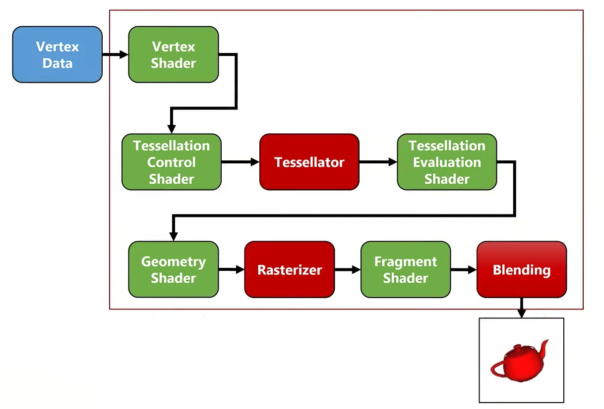

# Learn Graphics Together

Awesome collection of learning materials to learn Graphics.

## What is this about?

This repostory contains nearly dozen curated collections: learning materials, toolboxes, newspapers, working groups, collection of other collections. Everything you will find useful if you are interested in learning Graphics.

Here you can find:

- :mortar_board: [Learn](./learn.md) : collection of materials to learn Graphics.
- :old_key: [Comprehend](./concepts.md) : key concepts and dichotomies of Graphics.
- :chart_with_upwards_trend: [Systemize](./cheatsheets.md) : cheat sheets on Graphics.
- :wrench: [Explore](./toolbox.md) : toolbox of useful open source projects to reuse.
