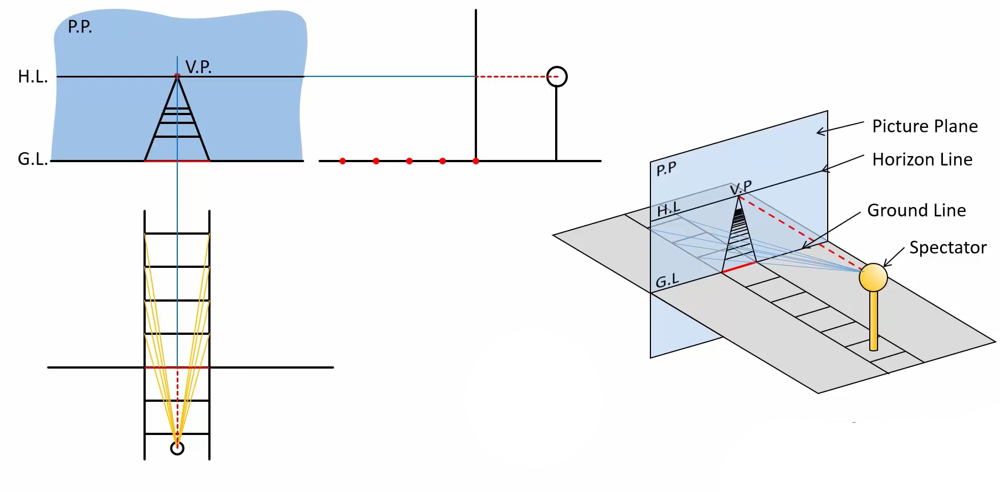
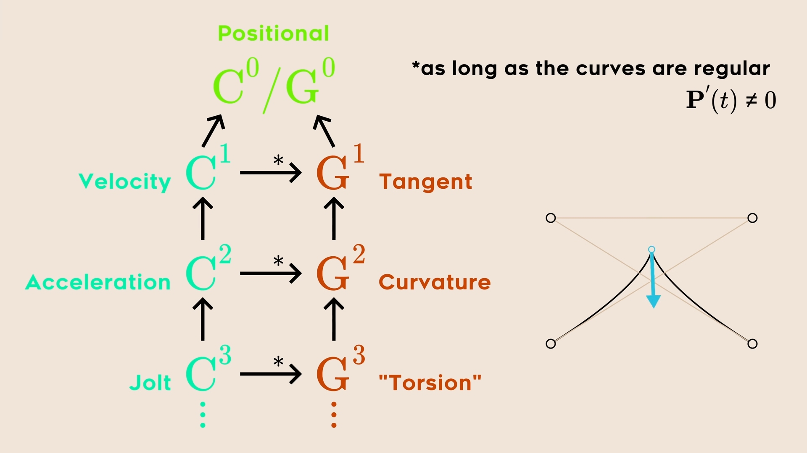
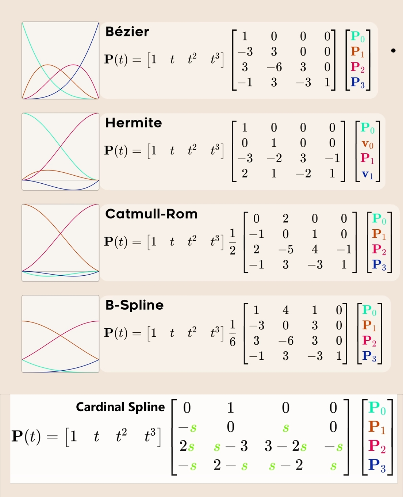

# Cheatsheets of Discrete Math.

<!-- [:arrow_down: Tags legend](#tags-legend) at the end of the page. -->

<!-- -  by  ( _:movie_camera:_ ) -->

## Coordinates Systems

( _math_ ) ( _transformation_ )

## Orthographic vs Perspective Frustum

( _math_ ) ( _transformation_ )

## Perspective vs Orthographic

( _math_ ) ( _transformation_ )

## Perspective Distortion

( _math_ ) ( _transformation_ )

## Perspective Explained

( _math_ ) ( _transformation_ )

## Curve Continuity

( _math_ ) ( _curve_ )

## Curves Comparison

( _math_ ) ( _curve_ )

## Curves Equations

( _math_ ) ( _curve_ )

